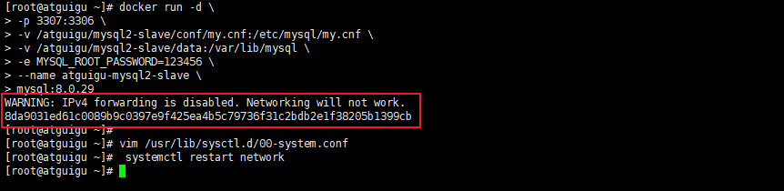

`尚硅谷_ShardingSphere5`                                                                                       让天下没有难学的技术

------


# 第01章 高性能架构模式

互联网业务兴起之后，海量用户加上海量数据的特点，单个数据库服务器已经难以满足业务需要，必须考虑数据库集群的方式来提升性能。高性能数据库集群的`第一种方式是“读写分离”`，`第二种方式是“数据库分片”`。


## 1、读写分离架构

**读写分离原理：**读写分离的基本原理是将数据库读写操作分散到不同的节点上，下面是其基本架构图：


**读写分离的基本实现：**

-  `主库负责处理事务性的增删改操作，从库负责处理查询操作`，能够有效的避免由数据更新导致的行锁，使得整个系统的查询性能得到极大的改善。
-  读写分离是`根据 SQL 语义的分析`，`将读操作和写操作分别路由至主库与从库`。
- 通过`一主多从`的配置方式，可以将查询请求均匀的分散到多个数据副本，能够进一步的提升系统的处理能力。 
- 使用`多主多从`的方式，不但能够提升系统的吞吐量，还能够提升系统的可用性，可以达到在任何一个数据库宕机，甚至磁盘物理损坏的情况下仍然不影响系统的正常运行。


**下图展示了根据业务需要，将用户表的写操作和读操路由到不同的数据库的方案：**


**CAP 理论：**

CAP 定理（CAP theorem）又被称作布鲁尔定理（Brewer's theorem），是加州大学伯克利分校的计算机科学家埃里克·布鲁尔（Eric Brewer）在 2000 年的 ACM PODC 上提出的一个猜想。`对于设计分布式系统的架构师来说，CAP 是必须掌握的理论。`


在一个`分布式系统中`，当涉及读写操作时，只能保证一致性（Consistence）、可用性（Availability）、分区容错性（Partition Tolerance）三者中的两个，另外一个必须被牺牲。

- C 一致性（Consistency）：对某个指定的客户端来说，读操作保证能够返回最新的写操作结果
- A 可用性（Availability）：非故障的节点在合理的时间内返回合理的响应`（不是错误和超时的响应）`
- P 分区容忍性（Partition Tolerance）：当出现网络分区后`（可能是丢包，也可能是连接中断，还可能是拥塞）`，系统能够继续“履行职责”


**CAP特点：**

- 在实际设计过程中，每个系统不可能只处理一种数据，而是包含多种类型的数据，`有的数据必须选择 CP，有的数据必须选择 AP，分布式系统理论上不可能选择 CA 架构。`

  

  - CP：如下图所示，`为了保证一致性`，当发生分区现象后，N1 节点上的数据已经更新到 y，但由于 N1 和 N2 之间的复制通道中断，数据 y 无法同步到 N2，N2 节点上的数据还是 x。`这时客户端 C 访问 N2 时，N2 需要返回 Error，提示客户端 C“系统现在发生了错误”，`这种处理方式`违背了可用性`（Availability）的要求，因此 CAP 三者只能满足 CP。

  

  > 悲观锁强行保证一致性

  
  
  - AP：如下图所示，`为了保证可用性`，当发生分区现象后，N1 节点上的数据已经更新到 y，但由于 N1 和 N2 之间的复制通道中断，数据 y 无法同步到 N2，N2 节点上的数据还是 x。`这时客户端 C 访问 N2 时，N2 将当前自己拥有的数据 x 返回给客户端 C 了`，而实际上当前最新的数据已经是 y 了，这就`不满足一致性`（Consistency）的要求了，因此 CAP 三者只能满足 AP。注意：这里 N2 节点返回 x，虽然不是一个“正确”的结果，但是一个“合理”的结果，因为 x 是旧的数据，并不是一个错乱的值，只是不是最新的数据而已。


- CAP 理论中的 `C 在实践中是不可能完美实现的`，在数据复制的过程中，节点N1 和节点 N2 的数据并不一致（强一致性）。即使无法做到`强一致性`，但应用可以采用适合的方式达到`最终一致性`。具有如下特点：

  - 基本可用（Basically Available）：分布式系统在出现故障时，允许损失部分可用性，即保证核心可用。
  - 软状态（Soft State）：允许系统存在中间状态，而该中间状态不会影响系统整体可用性。这里的中间状态就是 CAP 理论中的数据不一致。
  - `最终一致性（Eventual Consistency）：系统中的所有数据副本经过一定时间后，最终能够达到一致的状态。`


## 2、数据库分片架构

**读写分离的问题：**

读写分离分散了数据库读写操作的压力，但没有分散存储压力，为了满足业务数据存储的需求，就需要`将存储分散到多台数据库服务器上`。

**数据分片：**

将存放在单一数据库中的数据分散地存放至多个数据库或表中，以达到提升性能瓶颈以及可用性的效果。 数据分片的有效手段是对关系型数据库进行`分库和分表`。数据分片的拆分方式又分为`垂直分片和水平分片`。


### 2.1、垂直分片

**垂直分库：**

`按照业务拆分的方式称为垂直分片，又称为纵向拆分`，它的核心理念是专库专用。 在拆分之前，一个数据库由多个数据表构成，每个表对应着不同的业务。而拆分之后，则是按照业务将表进行归类，分布到不同的数据库中，从而将压力分散至不同的数据库。 


下图展示了根据业务需要，将用户表和订单表垂直分片到不同的数据库的方案：


垂直拆分可以缓解数据量和访问量带来的问题，但无法根治。`如果垂直拆分之后，表中的数据量依然超过单节点所能承载的阈值，则需要水平分片来进一步处理。`


**垂直分表：**

`垂直分表适合将表中某些不常用的列，或者是占了大量空间的列拆分出去。`

假设我们是一个婚恋网站，用户在筛选其他用户的时候，主要是用 age 和 sex 两个字段进行查询，而 nickname 和 description 两个字段主要用于展示，一般不会在业务查询中用到。description 本身又比较长，因此我们可以将这两个字段独立到另外一张表中，这样在查询 age 和 sex 时，就能带来一定的性能提升。

垂直分表引入的复杂性主要体现在表操作的数量要增加。例如，原来只要一次查询就可以获取 name、age、sex、nickname、description，现在需要两次查询，一次查询获取 name、age、sex，另外一次查询获取 nickname、description。


`水平分表适合表行数特别大的表，水平分表属于水平分片`。


### 2.2、水平分片

`水平分片又称为横向拆分。` 相对于垂直分片，它不再将数据根据业务逻辑分类，而是通过某个字段（或某几个字段），根据某种规则将数据分散至多个库或表中，每个分片仅包含数据的一部分。 例如：根据主键分片，偶数主键的记录放入 0 库（或表），奇数主键的记录放入 1 库（或表），如下图所示。


`单表进行切分后，是否将多个表分散在不同的数据库服务器中，可以根据实际的切分效果来确定。`

- **水平分表：**单表切分为多表后，新的表即使在同一个数据库服务器中，也可能带来可观的性能提升，如果性能能够满足业务要求，可以不拆分到多台数据库服务器，毕竟业务分库也会引入很多复杂性；

- **水平分库：**如果单表拆分为多表后，单台服务器依然无法满足性能要求，那就需要将多个表分散在不同的数据库服务器中。


> **阿里巴巴Java开发手册：**
>
> 【推荐】单表行数超过 500 万行或者单表容量超过 2GB，才推荐进行分库分表。
>
> 说明：如果预计三年后的数据量根本达不到这个级别，`请不要在创建表时就分库分表`。


## 3、读写分离和数据分片架构

 下图展现了将数据分片与读写分离一同使用时，应用程序与数据库集群之间的复杂拓扑关系。


## 4、实现方式

读写分离和数据分片具体的实现方式一般有两种：  `程序代码封装`和`中间件封装`。


### 4.1、程序代码封装

程序代码封装指在代码中抽象一个`数据访问层（或中间层封装）`，实现读写操作分离和数据库服务器连接的管理。

**其基本架构是：**以读写分离为例


### 4.2、中间件封装

中间件封装指的是`独立一套系统出来`，实现读写操作分离和数据库服务器连接的管理。对于业务服务器来说，访问中间件和访问数据库没有区别，在业务服务器看来，中间件就是一个数据库服务器。

**基本架构是：**以读写分离为例


### 4.3、常用解决方案

Apache ShardingSphere（程序级别和中间件级别）

MyCat（数据库中间件） 


# 第02章 ShardingSphere

## 1、简介

官网：https://shardingsphere.apache.org/index_zh.html

文档：https://shardingsphere.apache.org/document/5.1.1/cn/overview/

Apache ShardingSphere 由 JDBC、Proxy 和 Sidecar（规划中）这 3 款既能够独立部署，又支持混合部署配合使用的产品组成。 


## 2、ShardingSphere-JDBC

**程序代码封装**

定位为轻量级 Java 框架，`在 Java 的 JDBC 层提供的额外服务`。 它使用客户端直连数据库，`以 jar 包形式提供服务`，无需额外部署和依赖，可理解为增强版的 JDBC 驱动，完全兼容 JDBC 和各种 ORM 框架。


## 3、ShardingSphere-Proxy

**中间件封装**

定位为透明化的`数据库代理端`，提供封装了数据库二进制协议的服务端版本，用于完成对异构语言的支持。 目前提供 MySQL 和 PostgreSQL版本，它可以使用任何兼容 MySQL/PostgreSQL 协议的访问客户端（如：MySQL Command Client, MySQL Workbench, Navicat 等）操作数据，对 DBA 更加友好。


# 第03章 MySQL主从同步

## 1、MySQL主从同步原理


**基本原理：**

slave会从master读取binlog来进行数据同步

> 核心理念：读写分离则是根据 SQL 语义的分析，将读操作和写操作分别路由至主库与从库。

**具体步骤：**

- `step1：`master将数据改变记录到`二进制日志（binary log）`中。
- `step2：` 当slave上执行 `start slave` 命令之后，slave会创建一个 `IO 线程`用来连接master，请求master中的binlog。
- `step3：`当slave连接master时，master会创建一个 `log dump 线程`，用于发送 binlog 的内容。在读取 binlog 的内容的操作中，会对主节点上的 binlog 加锁，当读取完成并发送给从服务器后解锁。
- `step4：`IO 线程接收主节点 binlog dump 进程发来的更新之后，保存到 `中继日志（relay log）` 中。
- `step5：`slave的`SQL线程`，读取relay log日志，并解析成具体操作，从而实现主从操作一致，最终数据一致。


## 2、一主多从配置

服务器规划：使用`docker`方式创建，`主从服务器IP一致，端口号不一致`


- 主服务器：容器名`atguigu-mysql-master`，端口`3306`
- 从服务器：容器名`atguigu-mysql-slave1`，端口`3307`
- 从服务器：容器名`atguigu-mysql-slave2`，端口`3308`

**注意：**如果此时防火墙是开启的，`则先关闭防火墙，并重启docker`，否则后续安装的MySQL无法启动

```shell
#关闭docker
systemctl stop docker
#关闭防火墙
systemctl stop firewalld
#启动docker
systemctl start docker
```

### 2.1、准备主服务器

- **step1：在docker中创建并启动MySQL主服务器：**`端口3306`

```shell
docker run -d \
-p 3306:3306 \
-v /atguigu/mysql/master/conf:/etc/mysql/conf.d \
-v /atguigu/mysql/master/data:/var/lib/mysql \
-e MYSQL_ROOT_PASSWORD=123456 \
--name atguigu-mysql-master \
mysql:8.0.29
```


- **step2：创建MySQL主服务器配置文件：** 

默认情况下MySQL的binlog日志是自动开启的，可以通过如下配置定义一些可选配置

```shell
vim /atguigu/mysql/master/conf/my.cnf
```

配置如下内容

```properties
[mysqld]
# 服务器唯一id，默认值1
server-id=1
# 设置日志格式，默认值ROW
binlog_format=STATEMENT
# 二进制日志名，默认binlog
# log-bin=binlog
# 设置需要复制的数据库，默认复制全部数据库
#binlog-do-db=mytestdb
# 设置不需要复制的数据库
#binlog-ignore-db=mysql
#binlog-ignore-db=infomation_schema
```

重启MySQL容器

```shell
docker restart atguigu-mysql-master
```


`binlog格式说明：`

- binlog_format=STATEMENT：日志记录的是主机数据库的`写指令`，性能高，但是now()之类的函数以及获取系统参数的操作会出现主从数据不同步的问题。
- binlog_format=ROW（默认）：日志记录的是主机数据库的`写后的数据`，批量操作时性能较差，解决now()或者  user()或者  @@hostname 等操作在主从机器上不一致的问题。
- binlog_format=MIXED：是以上两种level的混合使用，有函数用ROW，没函数用STATEMENT，但是无法识别系统变量

>**binlog（Binary Log）** 记录的是 **二进制格式** 的日志
>
>‌**[MySQL](https://www.baidu.com/s?rsv_dl=re_dqa_generate&sa=re_dqa_generate&wd=MySQL&rsv_pq=982a722b004413d5&oq=binlog_format&rsv_t=b9c5RvyDEHmwDYHqR+4slyef3QocTVw8LkRbuN+QuOvKMtvcXK4AsAU1HKk&tn=baidu&ie=utf-8)中的[binlog_format](https://www.baidu.com/s?rsv_dl=re_dqa_generate&sa=re_dqa_generate&wd=binlog_format&rsv_pq=982a722b004413d5&oq=binlog_format&rsv_t=b9c5RvyDEHmwDYHqR+4slyef3QocTVw8LkRbuN+QuOvKMtvcXK4AsAU1HKk&tn=baidu&ie=utf-8)参数定义了二进制日志的记录格式，主要有三种模式：[STATEMENT](https://www.baidu.com/s?rsv_dl=re_dqa_generate&sa=re_dqa_generate&wd=STATEMENT&rsv_pq=982a722b004413d5&oq=binlog_format&rsv_t=b9c5RvyDEHmwDYHqR+4slyef3QocTVw8LkRbuN+QuOvKMtvcXK4AsAU1HKk&tn=baidu&ie=utf-8)、[ROW](https://www.baidu.com/s?rsv_dl=re_dqa_generate&sa=re_dqa_generate&wd=ROW&rsv_pq=982a722b004413d5&oq=binlog_format&rsv_t=b9c5RvyDEHmwDYHqR+4slyef3QocTVw8LkRbuN+QuOvKMtvcXK4AsAU1HKk&tn=baidu&ie=utf-8)和[MIXED](https://www.baidu.com/s?rsv_dl=re_dqa_generate&sa=re_dqa_generate&wd=MIXED&rsv_pq=982a722b004413d5&oq=binlog_format&rsv_t=b9c5RvyDEHmwDYHqR+4slyef3QocTVw8LkRbuN+QuOvKMtvcXK4AsAU1HKk&tn=baidu&ie=utf-8)。**‌
>
>### 三种模式的特点和适用场景
>
>1. ‌**STATEMENT模式**‌：
>
>   - ‌**特点**‌：每条修改数据的SQL语句都会记录到binlog中。这种模式下，binlog日志量较小，节约IO资源，提高性能。
>   - ‌**适用场景**‌：适用于对数据一致性要求不高，且不需要复制存储过程、函数等复杂操作的场景。
>
>2. ‌**ROW模式**‌：
>
>   - ‌**特点**‌：binlog日志中记录每一行数据修改的具体内容，不记录SQL语句的上下文信息。这种模式下，日志内容详细，但日志量较大。
>   - ‌**适用场景**‌：适用于需要精确复制每一行数据变化的场景，如金融交易系统等对数据一致性要求极高的应用。
>
>3. ‌**MIXED模式**‌：
>
>   - ‌**特点**‌：结合了STATEMENT和ROW模式的优点，MySQL会根据执行的SQL语句类型自动选择记录方式。对于普通的SQL语句使用STATEMENT模式，对于可能导致数据不一致的语句使用ROW模式。
>
>   - ‌**适用场景**‌：适用于需要平衡日志量和数据一致性的场景，既能够减少日志量，又能保证数据的一致性
>
>     

log-bin=binlog 格式说明：

>
>
>`log-bin=binlog` 是 MySQL 配置文件中的一个设置，用于启用二进制日志（Binary Log）。二进制日志记录了所有对 MySQL 数据库执行的更改操作，比如 `INSERT`、`UPDATE`、`DELETE` 等，这些日志对于数据库的复制、恢复以及故障排除非常有用。
>
>### 主要功能
>
>1. **数据库复制**： 启用二进制日志后，MySQL 可以作为主服务器，其他数据库可以作为从服务器，通过复制主服务器的二进制日志实现数据同步。主从复制是一种常见的数据库高可用和扩展技术。
>2. **数据恢复**： 二进制日志记录了数据库的所有修改操作，因此可以用来恢复数据库。通过将备份和二进制日志结合，您可以恢复到某个特定的时间点。
>3. **故障排除**： 如果数据库发生故障或者数据被误修改，二进制日志可以帮助您追踪和回滚到某个正确的状态。
>4. **审计和监控**： 二进制日志可以用来监控数据库中的所有修改操作，有助于审计数据库的使用情况。
>
>### 配置
>
>要启用二进制日志，需要在 MySQL 配置文件 `my.cnf`（或 `my.ini`，具体取决于操作系统）中添加或确保包含以下配置：
>
>```
>ini复制编辑[mysqld]
>log-bin=binlog
>```
>
>### 说明：
>
>- `log-bin`：表示启用二进制日志。日志文件的默认前缀名是 `binlog`，后面会附加一个数字编号（例如：`binlog.000001`）。
>- `binlog` 是日志文件的前缀名称。你可以修改为其他名称来标识你的二进制日志文件。例如：`log-bin=mysql-bin`。
>
>### 示例
>
>如果你配置了 `log-bin=binlog`，你的二进制日志文件将会是类似于：
>
>```
>python-repl复制编辑binlog.000001
>binlog.000002
>...
>```
>
>### 常用的配置项
>
>除了 `log-bin`，你还可以使用其他相关的配置项来控制二进制日志的行为：
>
>1. **指定二进制日志文件名**：
>
>   ```
>   ini
>   
>   
>   复制编辑
>   log-bin=mysql-bin
>   ```
>
>2. **设置二进制日志过期时间**： 可以设置 `expire_logs_days` 来指定二进制日志的过期时间，MySQL 会自动删除过期的日志文件。
>
>   ```
>   ini
>   
>   
>   复制编辑
>   expire_logs_days = 7
>   ```
>
>3. **配置二进制日志的格式**： MySQL 支持三种二进制日志格式：`STATEMENT`、`ROW` 和 `MIXED`。你可以通过 `binlog_format` 来配置日志格式。
>
>   ```
>   ini
>   
>   
>   复制编辑
>   binlog_format = ROW
>   ```
>
>4. **启用同步**： 在主从复制的环境中，确保同步配置正确，可以使用以下配置：
>
>   ```
>   ini复制编辑server-id = 1
>   log-bin = binlog
>   ```
>
>### 检查二进制日志
>
>你可以通过以下 SQL 命令查看当前 MySQL 的二进制日志状态：
>
>```
>sql
>
>
>复制编辑
>SHOW VARIABLES LIKE 'log_bin';
>```
>
>如果返回值是 `ON`，说明二进制日志已启用。
>
>你还可以通过以下命令查看当前的二进制日志文件：
>
>```
>sql
>
>
>复制编辑
>SHOW BINARY LOGS;
>```
>
>### 总结
>
>`log-bin=binlog` 主要用于启用 MySQL 的二进制日志功能。这个配置对实现数据库的主从复制、数据恢复、审计监控等功能非常重要。如果你没有开启二进制日志，可能会错过一些需要日志的应用场景。
>
>

`binlog-ignore-db和binlog-do-db的优先级问题：`


- **step3：使用命令行登录MySQL主服务器：**

```shell
#进入容器：env LANG=C.UTF-8 避免容器中显示中文乱码 
docker exec -it atguigu-mysql-master env LANG=C.UTF-8 /bin/bash
#进入容器内的mysql命令行
mysql -uroot -p
#修改默认密码校验方式
ALTER USER 'root'@'%' IDENTIFIED WITH mysql_native_password BY '123456';
```

> env LANG=C.UTF-8 专门用于中文
>
> `mysql_native_password` 是 MySQL 中的一种认证插件（authentication plugin），用于数据库用户身份验证。在 MySQL 中，用户登录时，服务器会根据配置的认证插件来验证用户的密码。
>
> 1. 在 MySQL 5.6 及更早版本中，`mysql_native_password` 是 MySQL 的默认认证插件。它使用传统的哈希算法（`SHA1`）来加密和验证密码。
>
> 2. MySQL 8.0，它默认使用 `caching_sha2_password` 插件作为认证插件
> 3. 你可以显式指定 `mysql_native_password` 插件来设置用户的密码

- **step4：主机中创建slave用户：**

```sql
-- 创建slave用户
CREATE USER 'atguigu_slave'@'%';
-- 设置密码
ALTER USER 'atguigu_slave'@'%' IDENTIFIED WITH mysql_native_password BY '123456';
-- 授予复制权限
GRANT REPLICATION SLAVE ON *.* TO 'atguigu_slave'@'%';
-- 刷新权限
FLUSH PRIVILEGES;
```


- **step5：主机中查询master状态：**

执行完此步骤后`不要再操作主服务器MYSQL`，防止主服务器状态值变化

```sql
SHOW MASTER STATUS;
```

记下`File`和`Position`的值。执行完此步骤后不要再操作主服务器MYSQL，防止主服务器状态值变化。


>
>
>`SHOW MASTER STATUS;` 是 MySQL 中的一个 SQL 命令，用于查看当前服务器的 **二进制日志** 状态，尤其是在 MySQL 主从复制配置中，它非常重要。
>
>### 功能：
>
>该命令返回当前 **主服务器** 上二进制日志的相关信息，主要包括以下字段：
>
>- **File**：当前正在写入的二进制日志文件的名称。
>- **Position**：在当前二进制日志文件中的当前位置（偏移量）。
>- **Binlog_Do_DB**：在二进制日志中包含的数据库名称（仅在 `binlog-do-db` 选项启用时出现）。
>- **Binlog_Ignore_DB**：在二进制日志中排除的数据库名称（仅在 `binlog-ignore-db` 选项启用时出现）。
>- **Executed_Gtid_Set**：如果启用了 GTID（全局事务标识符），该字段会列出已经执行的 GTID 集合。
>
>### 语法：
>
>```
>sql
>
>
>复制编辑
>SHOW MASTER STATUS;
>```
>
>### 返回结果：
>
>执行 `SHOW MASTER STATUS;` 后，MySQL 会返回一个类似以下的结果：
>
>| File             | Position | Binlog_Do_DB | Binlog_Ignore_DB | Executed_Gtid_Set |
>| ---------------- | -------- | ------------ | ---------------- | ----------------- |
>| mysql-bin.000001 | 107      |              |                  |                   |
>
>### 字段说明：
>
>1. **File**：
>   - 当前正在写入的二进制日志文件的名称。
>   - 每当 MySQL 生成一个新的二进制日志文件时，它会自动递增文件名（例如 `mysql-bin.000001`，`mysql-bin.000002` 等）。
>2. **Position**：
>   - 当前二进制日志的写入位置（偏移量）。它表示二进制日志中下一个即将写入的位置。
>   - 对于主从复制来说，`Position` 是非常重要的，因为它帮助从服务器确定从哪个位置开始复制主服务器的变更。
>3. **Binlog_Do_DB**（可选）：
>   - 显示在二进制日志中包含的数据库（如果设置了 `binlog-do-db` 配置项）。如果没有设置，则为空。
>4. **Binlog_Ignore_DB**（可选）：
>   - 显示在二进制日志中排除的数据库（如果设置了 `binlog-ignore-db` 配置项）。如果没有设置，则为空。
>5. **Executed_Gtid_Set**（可选）：
>   - 如果启用了 **GTID（全局事务标识符）**，则该字段会显示已经执行过的 GTID 集合。GTID 是一种用来标识和管理复制中每个事务的唯一标识符。
>
>### 应用场景：
>
>#### 1. **主从复制配置**：
>
>在 MySQL 主从复制中，`SHOW MASTER STATUS` 用于了解当前主服务器二进制日志的状态，从而帮助从服务器正确地从某个位置开始复制数据。
>
>例如，从服务器可以通过以下命令来配置从何时开始复制主服务器的数据：
>
>```
>sql
>
>
>复制编辑
>CHANGE MASTER TO MASTER_LOG_FILE='mysql-bin.000001', MASTER_LOG_POS=107;
>```
>
>`MASTER_LOG_FILE` 和 `MASTER_LOG_POS` 的值可以通过 `SHOW MASTER STATUS;` 获取。
>
>#### 2. **二进制日志的管理**：
>
>`SHOW MASTER STATUS` 还可以帮助你监控和管理二进制日志文件。例如，在做备份时，你可能需要知道最新的二进制日志文件和位置，以便准确地执行增量备份。
>
>#### 3. **故障恢复**：
>
>当你需要从某个点恢复数据库时，你可以通过 `SHOW MASTER STATUS` 确定当前的日志文件和位置，从而精确地恢复到特定的时间点或事务。
>
>### 示例：
>
>```
>sql复制编辑mysql> SHOW MASTER STATUS;
>+------------------+----------+-------------+------------------+-------------------+
>| File             | Position | Binlog_Do_DB| Binlog_Ignore_DB | Executed_Gtid_Set |
>+------------------+----------+-------------+------------------+-------------------+
>| mysql-bin.000001 | 107      |             |                  |                   |
>+------------------+----------+-------------+------------------+-------------------+
>1 row in set (0.00 sec)
>```
>
>- **File**：`mysql-bin.000001` 表示当前正在使用的二进制日志文件。
>- **Position**：`107` 表示当前二进制日志文件中的位置，表示下一个写入的位置。
>- **Binlog_Do_DB** 和 **Binlog_Ignore_DB** 是空的，表示没有配置特定的数据库包含或排除。
>- **Executed_Gtid_Set** 为空，表示没有启用 GTID。
>
>### 总结：
>
>- `SHOW MASTER STATUS` 是 MySQL 中用来查看主服务器当前二进制日志状态的重要命令，特别是在主从复制环境中非常有用。
>
>- 它返回的日志文件和位置可以帮助从服务器正确地开始复制。
>
>- 如果你启用了 GTID 或者配置了数据库过滤选项（如 `binlog-do-db` 或 `binlog-ignore-db`），它们也会显示在结果中。
>
>  


### 2.2、准备从服务器

可以配置多台从机slave1、slave2...，这里以配置slave1为例

- **step1：在docker中创建并启动MySQL从服务器：**`端口3307`

```shell
docker run -d \
-p 3307:3306 \
-v /atguigu/mysql/slave1/conf:/etc/mysql/conf.d \
-v /atguigu/mysql/slave1/data:/var/lib/mysql \
-e MYSQL_ROOT_PASSWORD=123456 \
--name atguigu-mysql-slave1 \
mysql:8.0.29
```


- **step2：创建MySQL从服务器配置文件：** 

```shell
vim /atguigu/mysql/slave1/conf/my.cnf
```

配置如下内容：

```properties
[mysqld]
# 服务器唯一id，每台服务器的id必须不同，如果配置其他从机，注意修改id
server-id=2
# 中继日志名，默认xxxxxxxxxxxx-relay-bin
#relay-log=relay-bin
```

> **中继日志**
>
> 在 MySQL 中，`relay-bin` 通常与 **MySQL 的复制机制** 相关，特别是与 **中继日志（Relay Log）** 相关。
>
> 在主从复制的架构中，**主服务器**（Master）会将执行的所有更改记录到 **二进制日志（binary log）** 中。这些日志记录了主服务器上所有的写操作（如 `INSERT`、`UPDATE`、`DELETE` 等）。然后，**从服务器**（Slave）会读取主服务器的二进制日志，并将这些更改应用到自己的数据库中。
>
> **Relay Log（中继日志）** 就是从服务器用来存储和应用主服务器二进制日志的地方。具体来说：
>
> - **relay-bin** 指的是中继日志的文件名。
> - 从服务器会通过读取中继日志来逐步执行主服务器上的操作，从而保持数据一致性

重启MySQL容器

```shell
docker restart atguigu-mysql-slave1
```


- **step3：使用命令行登录MySQL从服务器：**

```shell
#进入容器：
docker exec -it atguigu-mysql-slave1 env LANG=C.UTF-8 /bin/bash
#进入容器内的mysql命令行
mysql -uroot -p
#修改默认密码校验方式
ALTER USER 'root'@'%' IDENTIFIED WITH mysql_native_password BY '123456';
```


- **step4：在从机上配置主从关系：**

在**从机**上执行以下SQL操作

```sql
CHANGE MASTER TO MASTER_HOST='192.168.100.201', 
MASTER_USER='atguigu_slave',MASTER_PASSWORD='123456', MASTER_PORT=3306,
MASTER_LOG_FILE='binlog.000003',MASTER_LOG_POS=1357; 
```

> ### 参数解析：
>
> 1. **MASTER_HOST**：指定主服务器的 IP 地址或主机名。在这个命令中，主服务器的 IP 是 `192.168.100.201`。
>
> 2. **MASTER_USER**：指定用于从服务器连接主服务器的 MySQL 用户名。在此命令中，使用的是 `atguigu_slave`。
>
> 3. **MASTER_PASSWORD**：指定该用户的密码。在此命令中，密码为 `123456`。
>
> 4. **MASTER_PORT**：指定主服务器的端口号。默认 MySQL 端口是 3306，这里也是使用的默认端口。
>
> 5. **MASTER_LOG_FILE**：指定从服务器应该从主服务器的哪个二进制日志文件开始复制。在此命令中，`binlog.000003` 是日志文件的名称。
>
> 6. **MASTER_LOG_POS**：指定从服务器应该从主服务器的二进制日志文件中的哪个位置开始复制。这里的 `1357` 是日志中的位置偏移量。
>
>    
>
> ### 常见使用场景：
>
> 1. **主从复制配置**：这是在设置 **MySQL 主从复制** 时从服务器的一部分配置步骤。在运行这个命令之前，通常需要在主服务器上启用二进制日志（`log_bin`）并确保主服务器的 `binlog.000003` 文件中有需要复制的操作。
> 2. **恢复复制**：如果主服务器的二进制日志文件更新，或者主服务器和从服务器的连接发生了中断，使用 `MASTER_LOG_FILE` 和 `MASTER_LOG_POS` 可以指定从哪里重新开始复制。
>
> ### 步骤示例：
>
> 1. 在主服务器上启用二进制日志：
>
>    ```
>    [mysqld]
>    log_bin = /var/log/mysql/mysql-bin.log
>    server-id = 1
>    ```
>
>    你需要确保主服务器启用了二进制日志，并且 `server-id` 不与其他服务器冲突。
>
> 2. 在主服务器上查看当前的二进制日志文件和位置：
>
>    ```
>    复制编辑
>    SHOW MASTER STATUS;
>    ```
>
>    假设输出如下：
>
>    ```
>    +------------------+----------+--------------+------------------+
>    | File             | Position | Binlog_Do_DB | Binlog_Ignore_DB |
>    +------------------+----------+--------------+------------------+
>    | binlog.000003    | 1357     |              |                  |
>    +------------------+----------+--------------+------------------+
>    ```
>
> 3. 在从服务器上执行 `CHANGE MASTER TO` 命令：
>
>    ```
>    CHANGE MASTER TO MASTER_HOST='192.168.100.201', 
>    MASTER_USER='atguigu_slave', MASTER_PASSWORD='123456', 
>    MASTER_PORT=3306, MASTER_LOG_FILE='binlog.000003', 
>    MASTER_LOG_POS=1357;
>    ```
>
> 4. 启动从服务器的复制进程：
>
>    ```
>    复制编辑
>    START SLAVE;
>    ```
>
> 5. 检查复制状态：
>
>    ```
>    复制编辑
>    SHOW SLAVE STATUS\G;
>    ```
>
> 如果一切配置正确，从服务器将会开始从主服务器复制数据，保持数据库同步。


### 2.3、启动主从同步

启动从机的复制功能，执行SQL：

```sql
START SLAVE;
-- 查看状态（不需要分号）
SHOW SLAVE STATUS\G
```


**两个关键进程：**下面两个参数都是Yes，则说明主从配置成功！


> 对应两个核心线程 I/O thread 和 SQL thread
>
> 如果状态异常，错误信息会显示在
>
> Last IO Errno:0
> Last IO Error:
> Last SQL Errno:0
> Last SQLError:
>
> 

### 2.4、实现主从同步

在主机中执行以下SQL，在从机中查看数据库、表和数据是否已经被同步

```sql
CREATE DATABASE db_user;
USE db_user;
CREATE TABLE t_user (
 id BIGINT AUTO_INCREMENT,
 uname VARCHAR(30),
 PRIMARY KEY (id)
);
INSERT INTO t_user(uname) VALUES('zhang3');
INSERT INTO t_user(uname) VALUES(@@hostname);
```


### 2.5、停止和重置

需要的时候，可以使用如下SQL语句

```sql
-- 在从机上执行。功能说明：停止I/O 线程和SQL线程的操作。
stop slave; 

-- 在从机上执行。功能说明：用于删除SLAVE数据库的relaylog日志文件，并重新启用新的relaylog文件。
reset slave;

-- 在主机上执行。功能说明：删除所有的binglog日志文件，并将日志索引文件清空，重新开始所有新的日志文件。
-- 用于第一次进行搭建主从库时，进行主库binlog初始化工作；
reset master;
```


### **2.6、常见问题**

#### 问题1

启动主从同步后，常见错误是`Slave_IO_Running： No 或者 Connecting` 的情况，此时查看下方的 `Last_IO_ERROR`错误日志，根据日志中显示的错误信息在网上搜索解决方案即可


**典型的错误例如：**`Last_IO_Error: Got fatal error 1236 from master when reading data from binary log: 'Client requested master to start replication from position > file size'`

**解决方案：**

```sql
-- 在从机停止slave
SLAVE STOP;

-- 在主机查看mater状态
SHOW MASTER STATUS;
-- 在主机刷新日志
FLUSH LOGS;
-- 再次在主机查看mater状态（会发现File和Position发生了变化）
SHOW MASTER STATUS;
-- 修改从机连接主机的SQL，并重新连接即可
```


#### 问题2

启动docker容器后提示 `WARNING: IPv4 forwarding is disabled. Networking will not work.`



此错误，虽然不影响主从同步的搭建，但是如果想从远程客户端通过以下方式连接docker中的MySQL则没法连接

```shell
C:\Users\administrator>mysql -h 192.168.100.201 -P 3306 -u root -p
```

**解决方案：**

```shell
#修改配置文件：
vim /usr/lib/sysctl.d/00-system.conf
#追加
net.ipv4.ip_forward=1
#接着重启网络
systemctl restart network
```

> 此问题产生原样是，需要先开放防火墙端口 再启动docker容器做端口映射。这样docker容器才能实现端口映射
>
> 报此错，服务器中可以使用容器，外部客户端连接容器会失败

# 第04章 ShardingSphere-JDBC读写分离

> 主从复制配合读写分离,这是 MySQL 主从复制最常见的应用场景之一,能够有效分担主服务器的压力，提升系统性能和可扩展性，同时保证高可用性。
>
> 主从复制的实际意义，关键在于 **需求**。如果你的应用需要处理大量的读取操作，结合读写分离会更有效。如果仅仅需要提高数据的可用性、容灾恢复或者备份能力，单独使用主从复制也是非常有价值的。

## 1、创建SpringBoot程序

### 1.1、创建项目

项目类型：Spring Initializr

SpringBoot脚手架：http://start.aliyun.com

项目名：sharding-jdbc-demo

SpringBoot版本：2.3.7.RELEASE

> 
>
> SpringBoot脚手架

### 1.2、添加依赖

```xml
<dependencies>
    <dependency>
        <groupId>org.springframework.boot</groupId>
        <artifactId>spring-boot-starter-web</artifactId>
    </dependency>

    <dependency>
        <groupId>org.apache.shardingsphere</groupId>
        <artifactId>shardingsphere-jdbc-core-spring-boot-starter</artifactId>
        <version>5.1.1</version>
    </dependency>

    <dependency>
        <groupId>mysql</groupId>
        <artifactId>mysql-connector-java</artifactId>
        <scope>runtime</scope>
    </dependency>

    <dependency>
        <groupId>com.baomidou</groupId>
        <artifactId>mybatis-plus-boot-starter</artifactId>
        <version>3.3.1</version>
    </dependency>

    <dependency>
        <groupId>org.projectlombok</groupId>
        <artifactId>lombok</artifactId>
        <optional>true</optional>
    </dependency>
    
    <dependency>
        <groupId>org.springframework.boot</groupId>
        <artifactId>spring-boot-starter-test</artifactId>
        <scope>test</scope>
        <exclusions>
            <exclusion>
                <groupId>org.junit.vintage</groupId>
                <artifactId>junit-vintage-engine</artifactId>
            </exclusion>
        </exclusions>
    </dependency>
</dependencies>
```


### 1.3、创建实体类

```java
package com.atguigu.shardingjdbcdemo.entity;

@TableName("t_user")
@Data
public class User {
    @TableId(type = IdType.AUTO)
    private Long id;
    private String uname;
}
```

> 1. 如果你不使用 @TableName，MyBatis-Plus 默认会将实体类名（类名的小写形式）作为表名。这是基于 Java 类名到数据库表名的一种约定。比如，如果你有一个 User 类，默认情况下，MyBatis-Plus 会将其映射到 user 表。
> 2. MyBatis-Plus 的 @TableName 注解不仅可以映射实际的数据库表，还可以映射数据库中的视图。

### 1.4、创建Mapper

```java
package com.atguigu.shardingjdbcdemo.mapper;

@Mapper
public interface UserMapper extends BaseMapper<User> {
}
```


### 1.5、配置读写分离

application.properties：

```properties
# 应用名称
spring.application.name=sharging-jdbc-demo
# 开发环境设置
spring.profiles.active=dev
# 内存模式
spring.shardingsphere.mode.type=Memory

# 配置真实数据源
spring.shardingsphere.datasource.names=master,slave1,slave2

# 配置第 1 个数据源
spring.shardingsphere.datasource.master.type=com.zaxxer.hikari.HikariDataSource
spring.shardingsphere.datasource.master.driver-class-name=com.mysql.jdbc.Driver
spring.shardingsphere.datasource.master.jdbc-url=jdbc:mysql://192.168.100.201:3306/db_user
spring.shardingsphere.datasource.master.username=root
spring.shardingsphere.datasource.master.password=123456

# 配置第 2 个数据源
spring.shardingsphere.datasource.slave1.type=com.zaxxer.hikari.HikariDataSource
spring.shardingsphere.datasource.slave1.driver-class-name=com.mysql.jdbc.Driver
spring.shardingsphere.datasource.slave1.jdbc-url=jdbc:mysql://192.168.100.201:3307/db_user
spring.shardingsphere.datasource.slave1.username=root
spring.shardingsphere.datasource.slave1.password=123456

# 配置第 3 个数据源
spring.shardingsphere.datasource.slave2.type=com.zaxxer.hikari.HikariDataSource
spring.shardingsphere.datasource.slave2.driver-class-name=com.mysql.jdbc.Driver
spring.shardingsphere.datasource.slave2.jdbc-url=jdbc:mysql://192.168.100.201:3308/db_user
spring.shardingsphere.datasource.slave2.username=root
spring.shardingsphere.datasource.slave2.password=123456

# 读写分离类型，如: Static，Dynamic
spring.shardingsphere.rules.readwrite-splitting.data-sources.myds.type=Static
# 写数据源名称
spring.shardingsphere.rules.readwrite-splitting.data-sources.myds.props.write-data-source-name=master
# 读数据源名称，多个从数据源用逗号分隔
spring.shardingsphere.rules.readwrite-splitting.data-sources.myds.props.read-data-source-names=slave1,slave2

# 负载均衡算法名称
spring.shardingsphere.rules.readwrite-splitting.data-sources.myds.load-balancer-name=alg_round

# 负载均衡算法配置
# 负载均衡算法类型
spring.shardingsphere.rules.readwrite-splitting.load-balancers.alg_round.type=ROUND_ROBIN
spring.shardingsphere.rules.readwrite-splitting.load-balancers.alg_random.type=RANDOM
spring.shardingsphere.rules.readwrite-splitting.load-balancers.alg_weight.type=WEIGHT
spring.shardingsphere.rules.readwrite-splitting.load-balancers.alg_weight.props.slave1=1
spring.shardingsphere.rules.readwrite-splitting.load-balancers.alg_weight.props.slave2=2

# 打印SQl
spring.shardingsphere.props.sql-show=true
```


## 2、测试

### 2.1、读写分离测试

```java
package com.atguigu.shardingjdbcdemo;

@SpringBootTest
class ReadwriteTest {

    @Autowired
    private UserMapper userMapper;

    /**
     * 写入数据的测试
     */
    @Test
    public void testInsert(){

        User user = new User();
        user.setUname("张三丰");
        userMapper.insert(user);
    }

}
```


### 2.2、事务测试

为了保证主从库间的事务一致性，避免跨服务的分布式事务，ShardingSphere-JDBC的`主从模型中，事务中的数据读写均用主库`。

 * 不添加@Transactional：insert对主库操作，select对从库操作
 * 添加@Transactional：则insert和select均对主库操作
 * **注意：**在JUnit环境下的@Transactional注解，默认情况下就会对事务进行回滚（**即使在没加注解@Rollback，也会对事务回滚**）

```java
/**
     * 事务测试
     */
@Transactional//开启事务
@Test
public void testTrans(){

    User user = new User();
    user.setUname("铁锤");
    userMapper.insert(user);

    List<User> users = userMapper.selectList(null);
}
```

### 2.3、负载均衡测试

```java

/**
     * 读数据测试
     */
@Test
public void testSelectAll(){
    List<User> users = userMapper.selectList(null);
    List<User> users = userMapper.selectList(null);//执行第二次测试负载均衡
    users.forEach(System.out::println);
}

```

>  需要在一个进程中多次调用才能测试负载 每次调用一次测试方法只能请求第一个从库

也可以在web请求中测试负载均衡

```java
package com.atguigu.shardingjdbcdemo.controller;

@RestController
@RequestMapping("/userController")
public class UserController {

    @Autowired
    private UserMapper userMapper;

    /**
     * 测试负载均衡策略
     */
    @GetMapping("selectAll")
    public void selectAll(){
        List<User> users = userMapper.selectList(null);
        users.forEach(System.out::println);
    }
}
```

# ShardingSphere-JDBC读写分离的原理解析（基于ai）

### 读写分离的实现原理

#### 1. **核心概念**

- **主库（Master）**：负责处理写操作（如 `INSERT`、`UPDATE`、`DELETE`）。
- **从库（Slave）**：负责处理读操作（如 `SELECT`）。
- **负载均衡**：将读操作均匀分配到多个从库上。

#### 2. **核心流程**

- **SQL 解析**：解析 SQL，判断是读操作还是写操作。
- **路由计算**：
  - 如果是写操作，路由到主库。
  - 如果是读操作，根据负载均衡策略选择一个从库。
- **SQL 执行**：在目标数据源上执行 SQL。
- **结果返回**：将结果返回给客户端。

#### 3. **核心组件**

- **MasterSlaveDataSource**：管理主库和从库的数据源。
- **MasterSlaveRule**：定义读写分离的规则（如主库、从库、负载均衡策略）。
- **MasterSlaveRouter**：负责路由计算，将读操作路由到从库，写操作路由到主库。
- **LoadBalanceStrategy**：定义从库的负载均衡策略（如轮询、随机等）。

------

### 读写分离的核心代码

#### 1. **MasterSlaveDataSource**

`MasterSlaveDataSource` 是读写分离的入口类，负责管理主库和从库的数据源。

**核心代码**：

java

复制

```
public final class MasterSlaveDataSource extends AbstractDataSourceAdapter {
    private final MasterSlaveRule masterSlaveRule;

    public MasterSlaveDataSource(final Map<String, DataSource> dataSourceMap, final MasterSlaveRule masterSlaveRule, final Properties props) throws SQLException {
        this.masterSlaveRule = masterSlaveRule;
    }

    @Override
    public MasterSlaveConnection getConnection() throws SQLException {
        return new MasterSlaveConnection(masterSlaveRule);
    }
}
```

**作用**：

- 初始化 `MasterSlaveRule`，管理主库和从库的数据源。
- 提供 `getConnection()` 方法，返回一个支持读写分离的 `MasterSlaveConnection`。

------

#### 2. **MasterSlaveConnection**

`MasterSlaveConnection` 是读写分离的核心连接类，负责管理主库和从库的连接。

**核心代码**：

java

复制

```
public final class MasterSlaveConnection extends AbstractConnectionAdapter {
    private final MasterSlaveRule masterSlaveRule;

    public MasterSlaveConnection(final MasterSlaveRule masterSlaveRule) {
        this.masterSlaveRule = masterSlaveRule;
    }

    @Override
    protected Connection createConnection(final String dataSourceName, final DataSource dataSource) throws SQLException {
        return dataSource.getConnection();
    }
}
```

**作用**：

- 根据路由结果，从 `MasterSlaveRule` 中获取对应的数据源。
- 通过 `createConnection` 方法创建物理连接。

------

#### 3. **MasterSlaveRouter**

`MasterSlaveRouter` 是读写分离的路由核心类，负责根据 SQL 类型（读或写）选择目标数据源。

**核心代码**：

java

复制

```
public final class MasterSlaveRouter {
    private final MasterSlaveRule masterSlaveRule;

    public MasterSlaveRouter(final MasterSlaveRule masterSlaveRule) {
        this.masterSlaveRule = masterSlaveRule;
    }

    public String route(final String sql) {
        if (isWriteOperation(sql)) {
            return masterSlaveRule.getMasterDataSourceName();
        } else {
            return masterSlaveRule.getLoadBalanceStrategy().getDataSource(masterSlaveRule.getSlaveDataSourceNames());
        }
    }

    private boolean isWriteOperation(final String sql) {
        // 判断 SQL 是否是写操作
        return sql.trim().toLowerCase().startsWith("insert") ||
               sql.trim().toLowerCase().startsWith("update") ||
               sql.trim().toLowerCase().startsWith("delete");
    }
}
```

**作用**：

- 判断 SQL 是读操作还是写操作。
- 如果是写操作，返回主库的数据源名称。
- 如果是读操作，根据负载均衡策略选择一个从库的数据源名称。

------

#### 4. **LoadBalanceStrategy**

`LoadBalanceStrategy` 是从库负载均衡策略的接口，定义了如何选择从库。

**核心代码**：

java

复制

```
public interface LoadBalanceStrategy {
    String getDataSource(Collection<String> slaveDataSourceNames);
}
```

**作用**：

- 实现具体的负载均衡算法（如轮询、随机等）。
- 根据策略选择一个从库的数据源名称。

------

### 读写分离与数据分片的异同

#### **相同点**：

1. **统一入口**：
   - 读写分离和数据分片都通过 `ShardingDataSource` 或 `MasterSlaveDataSource` 提供统一的入口。
2. **路由逻辑**：
   - 两者都依赖于路由逻辑，根据 SQL 类型或分片键选择目标数据源。
3. **数据源管理**：
   - 两者都需要管理多个数据源，并通过配置定义数据源的映射关系。

#### **不同点**：

1. **目标不同**：
   - 读写分离的目标是将读操作和写操作分离，提升读性能和高可用性。
   - 数据分片的目标是将数据分散存储，提升存储和计算能力。
2. **路由规则不同**：
   - 读写分离的路由规则基于 SQL 类型（读或写）。
   - 数据分片的路由规则基于分片键和分片策略。
3. **配置方式不同**：
   - 读写分离的配置主要定义主库和从库的映射关系。
   - 数据分片的配置需要定义分片键、分片策略以及数据源和表的映射关系。


# 第05章 ShardingSphere-JDBC垂直分片

## 1、准备服务器

服务器规划：使用`docker`方式创建如下容器


- 服务器：容器名`server-user`，端口`3301`

- 服务器：容器名`server-order`，端口`3302`

  

### 1.1、创建server-user容器

- **step1：创建容器：**

```shell
docker run -d \
-p 3301:3306 \
-v /atguigu/server/user/conf:/etc/mysql/conf.d \
-v /atguigu/server/user/data:/var/lib/mysql \
-e MYSQL_ROOT_PASSWORD=123456 \
--name server-user \
mysql:8.0.29
```


- **step2：登录MySQL服务器：**

```shell
#进入容器：
docker exec -it server-user env LANG=C.UTF-8 /bin/bash
#进入容器内的mysql命令行
mysql -uroot -p
#修改默认密码插件
ALTER USER 'root'@'%' IDENTIFIED WITH mysql_native_password BY '123456';
```


- **step3：创建数据库：**

```sql
CREATE DATABASE db_user;
USE db_user;
CREATE TABLE t_user (
 id BIGINT AUTO_INCREMENT,
 uname VARCHAR(30),
 PRIMARY KEY (id)
);
```


### 1.2、创建server-order容器

- **step1：创建容器：**

```shell
docker run -d \
-p 3302:3306 \
-v /atguigu/server/order/conf:/etc/mysql/conf.d \
-v /atguigu/server/order/data:/var/lib/mysql \
-e MYSQL_ROOT_PASSWORD=123456 \
--name server-order \
mysql:8.0.29
```


- **step2：登录MySQL服务器：**

```shell
#进入容器：
docker exec -it server-order env LANG=C.UTF-8 /bin/bash
#进入容器内的mysql命令行
mysql -uroot -p
#修改默认密码插件
ALTER USER 'root'@'%' IDENTIFIED WITH mysql_native_password BY '123456';
```


- **step3：创建数据库：**

```sql
CREATE DATABASE db_order;
USE db_order;
CREATE TABLE t_order (
  id BIGINT AUTO_INCREMENT,
  order_no VARCHAR(30),
  user_id BIGINT,
  amount DECIMAL(10,2),
  PRIMARY KEY(id) 
);
```


## 2、程序实现

### 2.1、创建实体类

```java
package com.atguigu.shardingjdbcdemo.entity;

@TableName("t_order")
@Data
public class Order {
    @TableId(type = IdType.AUTO)
    private Long id;
    private String orderNo;
    private Long userId;
    private BigDecimal amount;
}
```


### 2.2、创建Mapper

```java
package com.atguigu.shardingjdbcdemo.mapper;

@Mapper
public interface OrderMapper extends BaseMapper<Order> {
}
```


### 2.3、配置垂直分片

```properties
# 应用名称
spring.application.name=sharding-jdbc-demo
# 环境设置
spring.profiles.active=dev

# 配置真实数据源
spring.shardingsphere.datasource.names=server-user,server-order

# 配置第 1 个数据源
spring.shardingsphere.datasource.server-user.type=com.zaxxer.hikari.HikariDataSource
spring.shardingsphere.datasource.server-user.driver-class-name=com.mysql.jdbc.Driver
spring.shardingsphere.datasource.server-user.jdbc-url=jdbc:mysql://192.168.100.201:3301/db_user
spring.shardingsphere.datasource.server-user.username=root
spring.shardingsphere.datasource.server-user.password=123456

# 配置第 2 个数据源
spring.shardingsphere.datasource.server-order.type=com.zaxxer.hikari.HikariDataSource
spring.shardingsphere.datasource.server-order.driver-class-name=com.mysql.jdbc.Driver
spring.shardingsphere.datasource.server-order.jdbc-url=jdbc:mysql://192.168.100.201:3302/db_order
spring.shardingsphere.datasource.server-order.username=root
spring.shardingsphere.datasource.server-order.password=123456

# 标准分片表配置（数据节点）
# spring.shardingsphere.rules.sharding.tables.<table-name>.actual-data-nodes=值
# 值由数据源名 + 表名组成，以小数点分隔。
# <table-name>：逻辑表名
spring.shardingsphere.rules.sharding.tables.t_user.actual-data-nodes=server-user.t_user
spring.shardingsphere.rules.sharding.tables.t_order.actual-data-nodes=server-order.t_order


# 打印SQL
spring.shardingsphere.props.sql-show=true

```


## 3、测试垂直分片

```java
package com.atguigu.shardingjdbcdemo;

@SpringBootTest
public class ShardingTest {


    @Autowired
    private UserMapper userMapper;

    @Autowired
    private OrderMapper orderMapper;

    /**
     * 垂直分片：插入数据测试
     */
    @Test
    public void testInsertOrderAndUser(){

        User user = new User();
        user.setUname("强哥");
        userMapper.insert(user);

        Order order = new Order();
        order.setOrderNo("ATGUIGU001");
        order.setUserId(user.getId());
        order.setAmount(new BigDecimal(100));
        orderMapper.insert(order);

    }

    /**
     * 垂直分片：查询数据测试
     */
    @Test
    public void testSelectFromOrderAndUser(){
        User user = userMapper.selectById(1L);
        Order order = orderMapper.selectById(1L);
    }
}
```

### 结果展示


> 核心看logic sql 逻辑上sql。和actual sql 真实sql，是shardingSphere转换后的真实sql

### 常见错误


ShardingSphere-JDBC远程连接的方式默认的密码加密规则是：mysql_native_password

因此需要在服务器端修改服务器的密码加密规则，如下：

```sql
ALTER USER 'root'@'%' IDENTIFIED WITH mysql_native_password BY '123456';
```


# 第06章 ShardingSphere-JDBC水平分片

## 1、准备服务器

服务器规划：使用`docker`方式创建如下容器


- 服务器：容器名`server-order0`，端口`3310`

- 服务器：容器名`server-order1`，端口`3311`

  

### 1.1、创建server-order0容器

- **step1：创建容器：**

```shell
docker run -d \
-p 3310:3306 \
-v /atguigu/server/order0/conf:/etc/mysql/conf.d \
-v /atguigu/server/order0/data:/var/lib/mysql \
-e MYSQL_ROOT_PASSWORD=123456 \
--name server-order0 \
mysql:8.0.29
```


- **step2：登录MySQL服务器：**

```shell
#进入容器：
docker exec -it server-order0 env LANG=C.UTF-8 /bin/bash
#进入容器内的mysql命令行
mysql -uroot -p
#修改默认密码插件
ALTER USER 'root'@'%' IDENTIFIED WITH mysql_native_password BY '123456';
```


- **step3：创建数据库：**

`注意：`水平分片的id需要在业务层实现，`不能依赖数据库的主键自增`

```sql
CREATE DATABASE db_order;
USE db_order;
CREATE TABLE t_order0 (
  id BIGINT,
  order_no VARCHAR(30),
  user_id BIGINT,
  amount DECIMAL(10,2),
  PRIMARY KEY(id) 
);
CREATE TABLE t_order1 (
  id BIGINT,
  order_no VARCHAR(30),
  user_id BIGINT,
  amount DECIMAL(10,2),
  PRIMARY KEY(id) 
);
```


### 1.2、创建server-order1容器

- **step1：创建容器：**

```shell
docker run -d \
-p 3311:3306 \
-v /atguigu/server/order1/conf:/etc/mysql/conf.d \
-v /atguigu/server/order1/data:/var/lib/mysql \
-e MYSQL_ROOT_PASSWORD=123456 \
--name server-order1 \
mysql:8.0.29
```


- **step2：登录MySQL服务器：**

```shell
#进入容器：
docker exec -it server-order1 env LANG=C.UTF-8 /bin/bash
#进入容器内的mysql命令行
mysql -uroot -p
#修改默认密码插件
ALTER USER 'root'@'%' IDENTIFIED WITH mysql_native_password BY '123456';
```


- **step3：创建数据库：**和server-order0相同

`注意：`水平分片的id需要在业务层实现，不能依赖数据库的主键自增

```sql
CREATE DATABASE db_order;
USE db_order;
CREATE TABLE t_order0 (
  id BIGINT,
  order_no VARCHAR(30),
  user_id BIGINT,
  amount DECIMAL(10,2),
  PRIMARY KEY(id) 
);
CREATE TABLE t_order1 (
  id BIGINT,
  order_no VARCHAR(30),
  user_id BIGINT,
  amount DECIMAL(10,2),
  PRIMARY KEY(id) 
);
```


## 2、基本水平分片

### 2.1、基本配置

```properties
#========================基本配置
# 应用名称
spring.application.name=sharging-jdbc-demo
# 开发环境设置
spring.profiles.active=dev
# 内存模式
spring.shardingsphere.mode.type=Memory
# 打印SQl
spring.shardingsphere.props.sql-show=true
```


### 2.2、数据源配置

```properties
#========================数据源配置
# 配置真实数据源
spring.shardingsphere.datasource.names=server-user,server-order0,server-order1

# 配置第 1 个数据源
spring.shardingsphere.datasource.server-user.type=com.zaxxer.hikari.HikariDataSource
spring.shardingsphere.datasource.server-user.driver-class-name=com.mysql.jdbc.Driver
spring.shardingsphere.datasource.server-user.jdbc-url=jdbc:mysql://192.168.100.201:3301/db_user
spring.shardingsphere.datasource.server-user.username=root
spring.shardingsphere.datasource.server-user.password=123456

# 配置第 2 个数据源
spring.shardingsphere.datasource.server-order.type=com.zaxxer.hikari.HikariDataSource
spring.shardingsphere.datasource.server-order.driver-class-name=com.mysql.jdbc.Driver
spring.shardingsphere.datasource.server-order.jdbc-url=jdbc:mysql://192.168.100.201:3310/db_order
spring.shardingsphere.datasource.server-order.username=root
spring.shardingsphere.datasource.server-order.password=123456

# 配置第 3 个数据源
spring.shardingsphere.datasource.server-order.type=com.zaxxer.hikari.HikariDataSource
spring.shardingsphere.datasource.server-order.driver-class-name=com.mysql.jdbc.Driver
spring.shardingsphere.datasource.server-order.jdbc-url=jdbc:mysql://192.168.100.201:3311/db_order
spring.shardingsphere.datasource.server-order.username=root
spring.shardingsphere.datasource.server-order.password=123456
```


### 2.3、标椎分片表配置

```properties
#========================标准分片表配置（数据节点配置）
# spring.shardingsphere.rules.sharding.tables.<table-name>.actual-data-nodes=值
# 值由数据源名 + 表名组成，以小数点分隔。多个表以逗号分隔，支持 inline 表达式。
# <table-name>：逻辑表名
spring.shardingsphere.rules.sharding.tables.t_user.actual-data-nodes=server-user.t_user
spring.shardingsphere.rules.sharding.tables.t_order.actual-data-nodes=server-order0.t_order0,server-order0.t_order1,server-order1.t_order0,server-order1.t_order1
```


修改Order实体类的主键策略：

```java
//@TableId(type = IdType.AUTO)//依赖数据库的主键自增策略
@TableId(type = IdType.ASSIGN_ID)//分布式id
```

测试：保留上面配置中的一个分片表节点分别进行测试，检查每个分片节点是否可用

```java
/**
     * 水平分片：插入数据测试
     */
@Test
public void testInsertOrder(){

    Order order = new Order();
    order.setOrderNo("ATGUIGU001");
    order.setUserId(1L);
    order.setAmount(new BigDecimal(100));
    orderMapper.insert(order);
}
```


### 2.4、行表达式

优化上一步的分片表配置

https://shardingsphere.apache.org/document/5.1.1/cn/features/sharding/concept/inline-expression/

```properties
#========================标准分片表配置（数据节点配置）
# spring.shardingsphere.rules.sharding.tables.<table-name>.actual-data-nodes=值
# 值由数据源名 + 表名组成，以小数点分隔。多个表以逗号分隔，支持 inline 表达式。
# <table-name>：逻辑表名
spring.shardingsphere.rules.sharding.tables.t_user.actual-data-nodes=server-user.t_user
spring.shardingsphere.rules.sharding.tables.t_order.actual-data-nodes=server-order$->{0..1}.t_order$->{0..1}
```


### 2.5、分片算法配置

#### **水平分库：**

分片规则：order表中`user_id`为偶数时，数据插入`server-order0服务器`，`user_id`为奇数时，数据插入`server-order1服务器`。这样分片的好处是，同一个用户的订单数据，一定会被插入到同一台服务器上，查询一个用户的订单时效率较高。

```properties
#------------------------分库策略
# 分片列名称
spring.shardingsphere.rules.sharding.tables.t_order.database-strategy.standard.sharding-column=user_id
# 分片算法名称
spring.shardingsphere.rules.sharding.tables.t_order.database-strategy.standard.sharding-algorithm-name=alg_inline_userid

#------------------------分片算法配置
# 行表达式分片算法
# 分片算法类型
spring.shardingsphere.rules.sharding.sharding-algorithms.alg_inline_userid.type=INLINE
# 分片算法属性配置
spring.shardingsphere.rules.sharding.sharding-algorithms.alg_inline_userid.props.algorithm-expression=server-order$->{user_id % 2}

# 取模分片算法
# 分片算法类型
spring.shardingsphere.rules.sharding.sharding-algorithms.alg_mod.type=MOD
# 分片算法属性配置
spring.shardingsphere.rules.sharding.sharding-algorithms.alg_mod.props.sharding-count=2
```


为了方便测试，先设置只在 `t_order0`表上进行测试

```properties
xxx.actual-data-nodes=server-order$->{0..1}.t_order0
```


测试：可以分别测试行表达式分片算法和取模分片算法

```java
/**
     * 水平分片：分库插入数据测试
     */
@Test
public void testInsertOrderDatabaseStrategy(){

    for (long i = 0; i < 4; i++) {
        Order order = new Order();
        order.setOrderNo("ATGUIGU001");
        order.setUserId(i + 1);
        order.setAmount(new BigDecimal(100));
        orderMapper.insert(order);
    }

}
```


#### **水平分表：**

分片规则：order表中`order_no的哈希值为偶数时`，数据插入对应服务器的`t_order0表`，`order_no的哈希值为奇数时`，数据插入对应服务器的`t_order1表`。因为order_no是字符串形式，因此不能直接取模。

```properties
#------------------------分表策略
# 分片列名称
spring.shardingsphere.rules.sharding.tables.t_order.table-strategy.standard.sharding-column=order_no
# 分片算法名称
spring.shardingsphere.rules.sharding.tables.t_order.table-strategy.standard.sharding-algorithm-name=alg_hash_mod


#------------------------分片算法配置
# 哈希取模分片算法
# 分片算法类型
spring.shardingsphere.rules.sharding.sharding-algorithms.alg_hash_mod.type=HASH_MOD
# 分片算法属性配置
spring.shardingsphere.rules.sharding.sharding-algorithms.alg_hash_mod.props.sharding-count=2

```


测试前不要忘记将如下节点改回原来的状态

```properties
xxx.actual-data-nodes=server-order$->{0..1}.t_order$->{0..1}
```


测试：

```java
/**
     * 水平分片：分表插入数据测试
     */
@Test
public void testInsertOrderTableStrategy(){

    for (long i = 1; i < 5; i++) {

        Order order = new Order();
        order.setOrderNo("ATGUIGU" + i);
        order.setUserId(1L);
        order.setAmount(new BigDecimal(100));
        orderMapper.insert(order);
    }

    for (long i = 5; i < 9; i++) {

        Order order = new Order();
        order.setOrderNo("ATGUIGU" + i);
        order.setUserId(2L);
        order.setAmount(new BigDecimal(100));
        orderMapper.insert(order);
    }
}

/**
     * 测试哈希取模
     */
@Test
public void testHash(){

    //注意hash取模的结果是整个字符串hash后再取模，和数值后缀是奇数还是偶数无关
    System.out.println("ATGUIGU001".hashCode() % 2);
    System.out.println("ATGUIGU0011".hashCode() % 2);
}
```


**查询测试：**

```java
/**
     * 水平分片：查询所有记录
     * 查询了两个数据源，每个数据源中使用UNION ALL连接两个表
     */
@Test
public void testShardingSelectAll(){

    List<Order> orders = orderMapper.selectList(null);
    orders.forEach(System.out::println);
}

/**
     * 水平分片：根据user_id查询记录
     * 查询了一个数据源，每个数据源中使用UNION ALL连接两个表
     */
@Test
public void testShardingSelectByUserId(){

    QueryWrapper<Order> orderQueryWrapper = new QueryWrapper<>();
    orderQueryWrapper.eq("user_id", 1L);
    List<Order> orders = orderMapper.selectList(orderQueryWrapper);
    orders.forEach(System.out::println);
}
```

> 当根据id进行查询时 没有访问order2库 因为是根据user_id做的水平分库。这就是用user_id做水平分库的原因，因为会经常用user_id查询数据
>
> 可以提高查询效率
>
> 有多重分片算法 不同分片算法用于不同场景

结果展示

全量查询


id查询


### 2.6、分布式序列算法

**雪花算法：**

https://shardingsphere.apache.org/document/5.1.1/cn/features/sharding/concept/key-generator/


水平分片需要关注全局序列，因为不能简单的使用基于数据库的主键自增。

这里有两种方案：一种是基于MyBatisPlus的id策略；一种是ShardingSphere-JDBC的全局序列配置。

`基于MyBatisPlus的id策略：`将Order类的id设置成如下形式

```java
@TableId(type = IdType.ASSIGN_ID)
private Long id;
```


`基于ShardingSphere-JDBC的全局序列配置`：和前面的MyBatisPlus的策略二选一

```properties
#------------------------分布式序列策略配置
# 分布式序列列名称
spring.shardingsphere.rules.sharding.tables.t_order.key-generate-strategy.column=id
# 分布式序列算法名称
spring.shardingsphere.rules.sharding.tables.t_order.key-generate-strategy.key-generator-name=alg_snowflake

# 分布式序列算法配置
# 分布式序列算法类型
spring.shardingsphere.rules.sharding.key-generators.alg_snowflake.type=SNOWFLAKE
# 分布式序列算法属性配置
#spring.shardingsphere.rules.sharding.key-generators.alg_snowflake.props.xxx=
```

此时，需要将实体类中的id策略修改成以下形式：

```java
//当配置了shardingsphere-jdbc的分布式序列时，自动使用shardingsphere-jdbc的分布式序列
//当没有配置shardingsphere-jdbc的分布式序列时，自动依赖数据库的主键自增策略
@TableId(type = IdType.AUTO)
```

> 特别注意 这边@TableId(type = IdType.ASSIGN_ID) 使用的mybatis-plus的雪花算法，优先级很高，如果配置shardingSphere的雪花算法需要配置@TableId(type = IdType.AUTO)，会自动判断，默认依赖数据库的主键自增策略

雪花算法

影响雪花算法的几个：时钟回拨 机器码重复 序列号超长


### 3.3、创建Mapper

## 3、多表关联

### 3.1、创建关联表

在`server-order0、server-order1`服务器中分别创建两张订单详情表`t_order_item0、t_order_item1`

我们希望`同一个用户的订单表和订单详情表中的数据都在同一个数据源中，避免跨库关联`，因此这两张表我们使用相同的分片策略。

那么在`t_order_item`中我们也需要创建`order_no`和`user_id`这两个分片键

```sql
CREATE TABLE t_order_item0(
    id BIGINT,
    order_no VARCHAR(30),
    user_id BIGINT,
    price DECIMAL(10,2),
    `count` INT,
    PRIMARY KEY(id)
);

CREATE TABLE t_order_item1(
    id BIGINT,
    order_no VARCHAR(30),
    user_id BIGINT,
    price DECIMAL(10,2),
    `count` INT,
    PRIMARY KEY(id)
);
```


### 3.2、创建实体类

```java
package com.atguigu.shardingjdbcdemo.entity;

@TableName("t_order_item")
@Data
public class OrderItem {
    //当配置了shardingsphere-jdbc的分布式序列时，自动使用shardingsphere-jdbc的分布式序列
    @TableId(type = IdType.AUTO)
    private Long id;
    private String orderNo;
    private Long userId;
    private BigDecimal price;
    private Integer count;
}
```


```java
package com.atguigu.shargingjdbcdemo.mapper;

@Mapper
public interface OrderItemMapper extends BaseMapper<OrderItem> {

}
```


### 3.4、配置关联表

t_order_item的分片表、分片策略、分布式序列策略和t_order一致

```properties
#------------------------标准分片表配置（数据节点配置）
spring.shardingsphere.rules.sharding.tables.t_order_item.actual-data-nodes=server-order$->{0..1}.t_order_item$->{0..1}

#------------------------分库策略
# 分片列名称
spring.shardingsphere.rules.sharding.tables.t_order_item.database-strategy.standard.sharding-column=user_id
# 分片算法名称
spring.shardingsphere.rules.sharding.tables.t_order_item.database-strategy.standard.sharding-algorithm-name=alg_mod

#------------------------分表策略
# 分片列名称
spring.shardingsphere.rules.sharding.tables.t_order_item.table-strategy.standard.sharding-column=order_no
# 分片算法名称
spring.shardingsphere.rules.sharding.tables.t_order_item.table-strategy.standard.sharding-algorithm-name=alg_hash_mod

#------------------------分布式序列策略配置
# 分布式序列列名称
spring.shardingsphere.rules.sharding.tables.t_order_item.key-generate-strategy.column=id
# 分布式序列算法名称
spring.shardingsphere.rules.sharding.tables.t_order_item.key-generate-strategy.key-generator-name=alg_snowflake
```


### 3.5、测试插入数据

同一个用户的订单表和订单详情表中的数据都在同一个数据源中，避免跨库关联

```java
/**
     * 测试关联表插入
     */
@Test
public void testInsertOrderAndOrderItem(){

    for (long i = 1; i < 3; i++) {

        Order order = new Order();
        order.setOrderNo("ATGUIGU" + i);
        order.setUserId(1L);
        orderMapper.insert(order);

        for (long j = 1; j < 3; j++) {
            OrderItem orderItem = new OrderItem();
            orderItem.setOrderNo("ATGUIGU" + i);
            orderItem.setUserId(1L);
            orderItem.setPrice(new BigDecimal(10));
            orderItem.setCount(2);
            orderItemMapper.insert(orderItem);
        }
    }

    for (long i = 5; i < 7; i++) {

        Order order = new Order();
        order.setOrderNo("ATGUIGU" + i);
        order.setUserId(2L);
        orderMapper.insert(order);

        for (long j = 1; j < 3; j++) {
            OrderItem orderItem = new OrderItem();
            orderItem.setOrderNo("ATGUIGU" + i);
            orderItem.setUserId(2L);
            orderItem.setPrice(new BigDecimal(1));
            orderItem.setCount(3);
            orderItemMapper.insert(orderItem);
        }
    }

}
```

> 不进行绑定表，查询结果会进行笛卡尔积

## 4、绑定表

**需求：**查询每个订单的订单号和总订单金额


### 4.1、创建VO对象

```java
package com.atguigu.shardingjdbcdemo.entity;

@Data
public class OrderVo {
    private String orderNo;
    private BigDecimal amount;
}
```


### 4.2、添加Mapper方法

```java
package com.atguigu.shardingjdbcdemo.mapper;

@Mapper
public interface OrderMapper extends BaseMapper<Order> {

    @Select({"SELECT o.order_no, SUM(i.price * i.count) AS amount",
            "FROM t_order o JOIN t_order_item i ON o.order_no = i.order_no",
            "GROUP BY o.order_no"})
    List<OrderVo> getOrderAmount();

}
```


### 4.3、测试关联查询

```java
/**
     * 测试关联表查询
     */
@Test
public void testGetOrderAmount(){

    List<OrderVo> orderAmountList = orderMapper.getOrderAmount();
    orderAmountList.forEach(System.out::println);
}
```


### 4.4、配置绑定表

在原来水平分片配置的基础上添加如下配置：

```properties
#------------------------绑定表
spring.shardingsphere.rules.sharding.binding-tables[0]=t_order,t_order_item
```

配置完绑定表后再次进行关联查询的测试：

- **如果不配置绑定表：测试的结果为8个SQL。**多表关联查询会出现笛卡尔积关联。

- **如果配置绑定表：测试的结果为4个SQL。** 多表关联查询不会出现笛卡尔积关联，关联查询效率将大大提升。


`绑定表：`指分片规则一致的一组分片表。 使用绑定表进行多表关联查询时，必须使用分片键进行关联，否则会出现笛卡尔积关联或跨库关联，从而影响查询效率。

## 5、广播表

### 4.1、什么是广播表

指所有的分片数据源中都存在的表，表结构及其数据在每个数据库中均完全一致。 适用于数据量不大且需要与海量数据的表进行关联查询的场景，例如：字典表。

广播具有以下特性：

（1）插入、更新操作会实时在所有节点上执行，保持各个分片的数据一致性

（2）查询操作，只从一个节点获取

（3）可以跟任何一个表进行 JOIN 操作


### 4.2、创建广播表

在server-order0、server-order1和server-user服务器中分别创建t_dict表

```sql
CREATE TABLE t_dict(
    id BIGINT,
    dict_type VARCHAR(200),
    PRIMARY KEY(id)
);
```


### 4.3、程序实现

#### 4.3.1、创建实体类

```java
package com.atguigu.shardingjdbcdemo.entity;

@TableName("t_dict")
@Data
public class Dict {
    //可以使用MyBatisPlus的雪花算法
    @TableId(type = IdType.ASSIGN_ID)
    private Long id;
    private String dictType;
}
```


#### 4.3.2、创建Mapper

```java
package com.atguigu.shardingjdbcdemo.mapper;

@Mapper
public interface DictMapper extends BaseMapper<Dict> {
}
```


#### 4.3.3、配置广播表

```properties
#数据节点可不配置，默认情况下，向所有数据源广播
spring.shardingsphere.rules.sharding.tables.t_dict.actual-data-nodes=server-user.t_dict,server-order$->{0..1}.t_dict

# 广播表
spring.shardingsphere.rules.sharding.broadcast-tables[0]=t_dict
```


### 4.4、测试广播表

```java
@Autowired
private DictMapper dictMapper;

/**
     * 广播表：每个服务器中的t_dict同时添加了新数据
     */
@Test
public void testBroadcast(){

    Dict dict = new Dict();
    dict.setDictType("type1");
    dictMapper.insert(dict);
}

/**
     * 查询操作，只从一个节点获取数据
     * 随机负载均衡规则
     */
@Test
public void testSelectBroadcast(){

    List<Dict> dicts = dictMapper.selectList(null);
    dicts.forEach(System.out::println);
}
```


其他的一些有关问题

>**ShardingSphere 是否支持垂直分表？**
>
>ShardingSphere 本身并不直接提供“垂直分表”的自动化配置，因为垂直分表通常需要根据业务逻辑手动定义。ShardingSphere 的核心功能是**分库分表**（水平分库、水平分表），而垂直分表更多是业务设计层面的问题。

# shardingSphere-JDBC 数据分片原理解析（基于ai）

**自动路由数据**的核心逻辑主要由以下几个类和组件完成。以下是核心类的关键代码和作用分析：

------

### 1. **ShardingDataSource**

`ShardingDataSource` 是 Sharding-JDBC 的入口类，负责管理多个数据源，并提供路由功能。

**核心代码**：

java

复制

```
public final class ShardingDataSource extends AbstractDataSourceAdapter {
    private final ShardingRuntimeContext runtimeContext;

    public ShardingDataSource(final Map<String, DataSource> dataSourceMap, final ShardingRule shardingRule, final Properties props) throws SQLException {
        this.runtimeContext = new ShardingRuntimeContext(dataSourceMap, shardingRule, props);
    }

    @Override
    public ShardingConnection getConnection() throws SQLException {
        return new ShardingConnection(runtimeContext);
    }
}
```

**作用**：

- 初始化 `ShardingRuntimeContext`，管理数据源和分片规则。
- 提供 `getConnection()` 方法，返回一个支持分片的 `ShardingConnection`。

------

### 2. **ShardingConnection**

`ShardingConnection` 是 Sharding-JDBC 的核心连接类，负责管理多个物理连接，并根据路由结果选择正确的数据源。

**核心代码**：

java

复制

```
public final class ShardingConnection extends AbstractConnectionAdapter {
    private final ShardingRuntimeContext runtimeContext;

    public ShardingConnection(final ShardingRuntimeContext runtimeContext) {
        this.runtimeContext = runtimeContext;
    }

    @Override
    protected Connection createConnection(final String dataSourceName, final DataSource dataSource) throws SQLException {
        return dataSource.getConnection();
    }
}
```

**作用**：

- 根据路由结果，从 `ShardingRuntimeContext` 中获取对应的数据源。
- 通过 `createConnection` 方法创建物理连接。

------

### 3. **ShardingRouter**

`ShardingRouter` 是路由的核心类，负责根据 SQL 和分片规则计算出目标数据源和表。

**核心代码**：

java

复制

```
public final class ShardingRouter {
    private final ShardingRule shardingRule;

    public ShardingRouter(final ShardingRule shardingRule) {
        this.shardingRule = shardingRule;
    }

    public RoutingResult route(final String sql, final List<Object> parameters) {
        // 解析 SQL
        SQLStatement sqlStatement = sqlParser.parse(sql);
        // 根据分片规则计算路由结果
        return shardingRule.route(sqlStatement, parameters);
    }
}
```

**作用**：

- 解析 SQL，生成 `SQLStatement`。
- 调用 `ShardingRule` 的 `route` 方法，计算路由结果。

------

### 4. **ShardingRule**

`ShardingRule` 是分片规则的核心类，定义了如何根据分片键和分片策略路由数据。

**核心代码**：

java

复制

```
public final class ShardingRule {
    private final Map<String, TableRule> tableRules;

    public RoutingResult route(final SQLStatement sqlStatement, final List<Object> parameters) {
        RoutingResult result = new RoutingResult();
        for (TableRule tableRule : tableRules.values()) {
            // 根据分片策略计算目标数据源和表
            Collection<RoutingTable> routingTables = tableRule.route(sqlStatement, parameters);
            result.getTableUnits().addAll(routingTables);
        }
        return result;
    }
}
```

**作用**：

- 管理所有表的分片规则（`TableRule`）。
- 调用 `TableRule` 的 `route` 方法，计算每个表的路由结果。

------

### 5. **TableRule**

`TableRule` 是表级别的分片规则，定义了表的分片策略。

**核心代码**：

java

复制

```
public final class TableRule {
    private final String logicTable;
    private final ShardingStrategy databaseShardingStrategy;
    private final ShardingStrategy tableShardingStrategy;

    public Collection<RoutingTable> route(final SQLStatement sqlStatement, final List<Object> parameters) {
        // 根据分片策略计算目标数据源和表
        Collection<String> dataSources = databaseShardingStrategy.doSharding(parameters);
        Collection<String> tables = tableShardingStrategy.doSharding(parameters);
        Collection<RoutingTable> result = new ArrayList<>();
        for (String dataSource : dataSources) {
            for (String table : tables) {
                result.add(new RoutingTable(dataSource, table));
            }
        }
        return result;
    }
}
```

**作用**：

- 根据分片策略（`ShardingStrategy`）计算目标数据源和表。
- 返回路由结果（`RoutingTable`）。

------

### 6. **ShardingStrategy**

`ShardingStrategy` 是分片策略的接口，定义了如何根据分片键计算目标数据源或表。

**核心代码**：

java

复制

```
public interface ShardingStrategy {
    Collection<String> doSharding(Collection<String> availableTargetNames, List<Object> shardingValues);
}
```

**作用**：

- 实现具体的分片算法（如精确分片、范围分片等）。
- 根据分片键值（`shardingValues`）计算目标数据源或表。

------

### 总结

Sharding-JDBC 的数据分片核心类包括：

1. **ShardingDataSource**：入口类，管理数据源。
2. **ShardingConnection**：管理物理连接。
3. **ShardingRouter**：负责 SQL 解析和路由计算。
4. **ShardingRule**：管理分片规则。
5. **TableRule**：表级别的分片规则。
6. **ShardingStrategy**：分片策略的实现。

这些类协同工作，实现了自动路由数据的功能。

# shardingSphere-JDBC 读写分离原理对比数据分片原理

- **读写分离**和**数据分片**是 Sharding-JDBC 的两大核心功能，分别解决不同的问题。
- 读写分离的实现原理基于 SQL 类型（读或写）的路由，核心组件包括 `MasterSlaveDataSource`、`MasterSlaveRouter` 和 `LoadBalanceStrategy`。
- 数据分片的实现原理基于分片键和分片策略的路由，核心组件包括 `ShardingDataSource`、`ShardingRouter` 和 `ShardingStrategy`。
- 两者在路由逻辑和配置方式上有明显区别，但都依赖于 Sharding-JDBC 的统一框架。
- 当 **读写分离** 和 **数据分片** 配合使用时，Sharding-JDBC 使用的是 **`ShardingDataSource`**，而不是 `MasterSlaveDataSource`。这是因为 `ShardingDataSource` 是 Sharding-JDBC 的核心入口类，它能够同时支持数据分片和读写分离的功能。

# 第07章 启动ShardingSphere-Proxy

## 1、获取

目前 ShardingSphere-Proxy 提供了 3 种获取方式：

- [二进制发布包](https://shardingsphere.apache.org/document/5.1.1/cn/user-manual/shardingsphere-proxy/startup/bin/)
- [Docker](https://shardingsphere.apache.org/document/5.1.1/cn/user-manual/shardingsphere-proxy/startup/docker/)
- [Helm](https://shardingsphere.apache.org/document/5.1.1/cn/user-manual/shardingsphere-proxy/startup/helm/)


## 2、使用二进制发布包安装

二进制包既可以Linux系统运行，又可以在windows系统运行

**step1：解压二进制包**

`apache-shardingsphere-5.1.1-shardingsphere-proxy-bin.tar.gz`

windows：使用解压软件解压文件

Linux：将文件上传至/opt目录，并解压

```shell
tar -zxvf apache-shardingsphere-5.1.1-shardingsphere-proxy-bin.tar.gz
```


**step2：MySQL驱动**

`mysql-connector-java-8.0.22.jar`

将MySQl驱动放至解压目录中的`ext-lib`目录


**spte3：修改配置conf/server.yaml**

```yaml
rules:
  - !AUTHORITY
    users:
      - root@%:root
    provider:
      type: ALL_PRIVILEGES_PERMITTED

props:
  sql-show: true
```


**spte4：启动ShardingSphere-Proxy**

Linux 操作系统请运行 `bin/start.sh`

Windows 操作系统请运行 `bin/start.bat` 

指定端口号和配置文件目录：`bin/start.bat ${proxy_port} ${proxy_conf_directory}` 


**step5：远程连接ShardingSphere-Proxy**

远程访问

```shell
mysql -h192.168.100.1 -P3307 -uroot -p
```


**step6：访问测试**

```sql
show databases;
```


## 3、使用Docker安装

**step1：启动Docker容器**

```shell
docker run -d \
-v /atguigu/server/proxy-a/conf:/opt/shardingsphere-proxy/conf \
-v /atguigu/server/proxy-a/ext-lib:/opt/shardingsphere-proxy/ext-lib \
-e ES_JAVA_OPTS="-Xmx256m -Xms256m -Xmn128m" \
-p 3321:3307 \
--name server-proxy-a \
apache/shardingsphere-proxy:5.1.1
```


**step2：上传MySQL驱动**

将MySQl驱动上传至`/atguigu/server/proxy-a/ext-lib`目录


**spte3：修改配置server.yaml**

```yaml
rules:
  - !AUTHORITY
    users:
      - root@%:root
    provider:
      type: ALL_PRIVILEGES_PERMITTED

props:
  sql-show: true
```

将配置文件上传至`/atguigu/server/proxy-a/conf`目录


**spte4：重启容器**

```shell
docker restart server-proxy-a
```


**step5：远程连接ShardingSphere-Proxy**

ShardingSphere-Proxy容器中默认情况下没有mysql命令行客户端的安装，因此需要远程访问

```shell
mysql -h192.168.100.201 -P3321 -uroot -p
```


**step6：访问测试**

```sql
show databases;
```


**常见问题：docker容器无法远程连接**

容器可以成功的创建并启动，但是无法远程连接。排除防火墙和网络等问题后，看看是不是因为容器内存不足导致。

`原因：`容器可分配内存不足

`查看办法：`进入容器后查看ShardingSphere-Proxy的日志，如有有`cannot allocate memory`，则说明容器内存不足

```shell
docker exec -it server-proxy-a env LANG=C.UTF-8 /bin/bash
cd /opt/shardingsphere-proxy/logs
tail stdout.log 
```


`解决方案：`创建容器的时候使用JVM参数

```shell
-e ES_JAVA_OPTS="-Xmx256m -Xms256m -Xmn128m"
```


# 第08章 ShardingSphere-Proxy读写分离

## 1、修改配置文件

**修改配置config-readwrite-splitting.yaml**

```yaml
schemaName: readwrite_splitting_db

dataSources:
  write_ds:
    url: jdbc:mysql://192.168.100.201:3306/db_user?serverTimezone=UTC&useSSL=false
    username: root
    password: 123456
    connectionTimeoutMilliseconds: 30000
    idleTimeoutMilliseconds: 60000
    maxLifetimeMilliseconds: 1800000
    maxPoolSize: 50
    minPoolSize: 1
  read_ds_0:
    url: jdbc:mysql://192.168.100.201:3307/db_user?serverTimezone=UTC&useSSL=false
    username: root
    password: 123456
    connectionTimeoutMilliseconds: 30000
    idleTimeoutMilliseconds: 60000
    maxLifetimeMilliseconds: 1800000
    maxPoolSize: 50
    minPoolSize: 1
  read_ds_1:
    url: jdbc:mysql://192.168.100.201:3308/db_user?serverTimezone=UTC&useSSL=false
    username: root
    password: 123456
    connectionTimeoutMilliseconds: 30000
    idleTimeoutMilliseconds: 60000
    maxLifetimeMilliseconds: 1800000
    maxPoolSize: 50
    minPoolSize: 1

rules:
- !READWRITE_SPLITTING
  dataSources:
    readwrite_ds:
      type: Static
      props:
        write-data-source-name: write_ds
        read-data-source-names: read_ds_0,read_ds_1
```

将配置文件上传至`/atguigu/server/proxy-a/conf`目录


**重启容器**

```shell
docker restart server-proxy-a
```


## 2、实时查看日志

可以通过这种方式查看服务器中输出的SQL语句

```shell
docker exec -it server-proxy-a env LANG=C.UTF-8 /bin/bash
tail -f /opt/shardingsphere-proxy/logs/stdout.log 
```


## 3、远程访问测试

```sql
mysql> show databases;
mysql> use readwrite_splitting_db;
mysql> show tables;
mysql> select * from t_user;
mysql> select * from t_user;
mysql> insert into t_user(uname) values('wang5');
```


## 4、应用程序访问Proxy

### 4.1、创建项目

项目类型：Spring Initializr

SpringBoot脚手架：http://start.aliyun.com

项目名：sharding-proxy-demo

SpringBoot版本：2.3.7.RELEASE


### 4.2、添加依赖

```xml
<dependencies>
    <dependency>
        <groupId>org.springframework.boot</groupId>
        <artifactId>spring-boot-starter-web</artifactId>
    </dependency>

    <dependency>
        <groupId>mysql</groupId>
        <artifactId>mysql-connector-java</artifactId>
        <scope>runtime</scope>
    </dependency>

    <dependency>
        <groupId>com.baomidou</groupId>
        <artifactId>mybatis-plus-boot-starter</artifactId>
        <version>3.3.1</version>
    </dependency>

    <dependency>
        <groupId>org.projectlombok</groupId>
        <artifactId>lombok</artifactId>
        <optional>true</optional>
    </dependency>

    <dependency>
        <groupId>org.springframework.boot</groupId>
        <artifactId>spring-boot-starter-test</artifactId>
        <scope>test</scope>
        <exclusions>
            <exclusion>
                <groupId>org.junit.vintage</groupId>
                <artifactId>junit-vintage-engine</artifactId>
            </exclusion>
        </exclusions>
    </dependency>
</dependencies>
```


### 4.3、创建实体类

```java
package com.atguigu.shardingproxydemo.entity;

@TableName("t_user")
@Data
public class User {
    @TableId(type = IdType.AUTO)
    private Long id;
    private String uname;
}

```


### 4.4、创建Mapper

```java
package com.atguigu.shardingproxydemo.mapper;

@Mapper
public interface UserMapper extends BaseMapper<User> {
}
```


### 4.5、配置数据源

```properties
# 应用名称
spring.application.name=sharding-proxy-demo
# 开发环境设置
spring.profiles.active=dev

#mysql数据库连接（proxy）
spring.datasource.driver-class-name=com.mysql.jdbc.Driver
spring.datasource.url=jdbc:mysql://192.168.100.201:3321/readwrite_splitting_db?serverTimezone=GMT%2B8&useSSL=false
spring.datasource.username=root
spring.datasource.password=root

#mybatis日志
mybatis-plus.configuration.log-impl=org.apache.ibatis.logging.stdout.StdOutImpl
```


### 4.6、测试

```java
package com.atguigu.shardingproxydemo;

@SpringBootTest
class ShardingProxyDemoApplicationTests {

    @Autowired
    private UserMapper userMapper;

    /**
     * 读数据测试
     */
    @Test
    public void testSelectAll(){
        List<User> users = userMapper.selectList(null);
        users.forEach(System.out::println);
    }
}
```


# 第09章 ShardingSphere-Proxy垂直分片

## 1、修改配置文件

**修改配置config-sharding.yaml**

```yaml
schemaName: sharding_db

dataSources:
  ds_0:
    url: jdbc:mysql://192.168.100.201:3301/db_user?serverTimezone=UTC&useSSL=false
    username: root
    password: 123456
    connectionTimeoutMilliseconds: 30000
    idleTimeoutMilliseconds: 60000
    maxLifetimeMilliseconds: 1800000
    maxPoolSize: 50
    minPoolSize: 1
  ds_1:
    url: jdbc:mysql://192.168.100.201:3302/db_order?serverTimezone=UTC&useSSL=false
    username: root
    password: 123456
    connectionTimeoutMilliseconds: 30000
    idleTimeoutMilliseconds: 60000
    maxLifetimeMilliseconds: 1800000
    maxPoolSize: 50
    minPoolSize: 1

rules:
- !SHARDING
  tables:
    t_user:
      actualDataNodes: ds_0.t_user
    t_order:
      actualDataNodes: ds_1.t_order
```


## 2、实时查看日志

可以通过这种方式查看服务器中输出的SQL语句

```shell
docker exec -it server-proxy-a env LANG=C.UTF-8 /bin/bash
tail -f /opt/shardingsphere-proxy/logs/stdout.log 
```


## 3、远程访问测试

```sql
mysql> show databases;
mysql> use sharding_db;
mysql> show tables;
mysql> select * from t_order;
mysql> select * from t_user;
```


# 第10章 ShardingSphere-Proxy水平分片

## 1、修改配置文件

**修改配置config-sharding.yaml**

```yaml
schemaName: sharding_db

dataSources:
  ds_user:
    url: jdbc:mysql://192.168.100.201:3301/db_user?serverTimezone=UTC&useSSL=false
    username: root
    password: 123456
    connectionTimeoutMilliseconds: 30000
    idleTimeoutMilliseconds: 60000
    maxLifetimeMilliseconds: 1800000
    maxPoolSize: 50
    minPoolSize: 1
  ds_order0:
    url: jdbc:mysql://192.168.100.201:3310/db_order?serverTimezone=UTC&useSSL=false
    username: root
    password: 123456
    connectionTimeoutMilliseconds: 30000
    idleTimeoutMilliseconds: 60000
    maxLifetimeMilliseconds: 1800000
    maxPoolSize: 50
    minPoolSize: 1
  ds_order1:
    url: jdbc:mysql://192.168.100.201:3311/db_order?serverTimezone=UTC&useSSL=false
    username: root
    password: 123456
    connectionTimeoutMilliseconds: 30000
    idleTimeoutMilliseconds: 60000
    maxLifetimeMilliseconds: 1800000
    maxPoolSize: 50
    minPoolSize: 1

rules:
- !SHARDING
  tables:
    t_user:
      actualDataNodes: ds_user.t_user

    t_order:
      actualDataNodes: ds_order${0..1}.t_order${0..1}
      databaseStrategy:
        standard:
          shardingColumn: user_id
          shardingAlgorithmName: alg_mod
      tableStrategy:
        standard:
          shardingColumn: order_no
          shardingAlgorithmName: alg_hash_mod
      keyGenerateStrategy:
        column: id
        keyGeneratorName: snowflake
    t_order_item:
      actualDataNodes: ds_order${0..1}.t_order_item${0..1}
      databaseStrategy:
        standard:
          shardingColumn: user_id
          shardingAlgorithmName: alg_mod
      tableStrategy:
        standard:
          shardingColumn: order_no
          shardingAlgorithmName: alg_hash_mod
      keyGenerateStrategy:
        column: id
        keyGeneratorName: snowflake

  bindingTables:
    - t_order,t_order_item


  broadcastTables:
    - t_dict

  shardingAlgorithms:
    alg_inline_userid:
      type: INLINE
      props:
        algorithm-expression: server-order$->{user_id % 2}
    alg_mod:
      type: MOD
      props:
        sharding-count: 2
    alg_hash_mod:
      type: HASH_MOD
      props:
        sharding-count: 2
  
  keyGenerators:
    snowflake:
      type: SNOWFLAKE

```


## 2、实时查看日志

可以通过这种方式查看服务器中输出的SQL语句

```shell
docker exec -it server-proxy-a env LANG=C.UTF-8 /bin/bash
tail -f /opt/shardingsphere-proxy/logs/stdout.log 
```


## 3、远程访问测试

```sql
mysql> show databases;
mysql> use sharding_db;
mysql> show tables;
mysql> select * from t_order; --测试水平分片
mysql> select * from t_dict; --测试广播表
```

